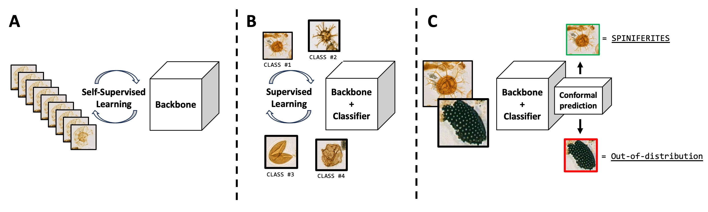

# Self-Supervised Learning with Microfossils using DINO

PyTorch implementation and pretrained models for DINO. This repo is an edited clone of the [DINO repo](https://github.com/facebookresearch/dino) and covers part A of the Fossil Frontier pipeline illustrated below.

<div align="center">
  
</div>

## Pretrained models
You can choose to download only the weights of the pretrained backbone used for downstream tasks, or the full checkpoint which contains backbone and projection head weights for both student and teacher networks. We also provide the detailed arguments and training logs. The `ImageNet` models are the same models presented in [https://github.com/facebookresearch/dino].

<table>
  <tr>
    <th>arch</th>
    <th>params</th>
    <th>nn f1</th>
    <th>p@n_k</th>
    <th colspan="4">download</th>
  </tr>
  <tr>
    <td>ViT-S/16 ImageNet</td>
    <td>21M</td>
    <td>0.78</td>
    <td>0.44</td>
    <td><a href="https://dl.fbaipublicfiles.com/dino/dino_deitsmall16_pretrain/dino_deitsmall16_pretrain.pth">backbone only</a></td>
    <td><a href="https://dl.fbaipublicfiles.com/dino/dino_deitsmall16_pretrain/dino_deitsmall16_pretrain_full_checkpoint.pth">full ckpt</a></td>
    <td><a href="https://dl.fbaipublicfiles.com/dino/dino_deitsmall16_pretrain/args.txt">args</a></td>
    <td><a href="https://dl.fbaipublicfiles.com/dino/dino_deitsmall16_pretrain/dino_deitsmall16_pretrain_log.txt">logs</a></td>
  </tr>
  <tr>
    <td>ViT-S/16 1.6M curated</td>
    <td>21M</td>
    <td>0.91</td>
    <td>0.60</td>
    <td><a href="">backbone only</a></td>
    <td><a href="">full ckpt</a></td>
    <td><a href="">args</a></td>
    <td><a href="">logs</a></td>
  </tr>
  <tr>
    <td>ViT-B/16 ImageNet</td>
    <td>85M</td>
    <td>0.81</td>
    <td>0.47</td>
    <td><a href="https://dl.fbaipublicfiles.com/dino/dino_vitbase16_pretrain/dino_vitbase16_pretrain.pth">backbone only</a></td>
    <td><a href="https://dl.fbaipublicfiles.com/dino/dino_vitbase16_pretrain/dino_vitbase16_pretrain_full_checkpoint.pth">full ckpt</a></td>
    <td><a href="https://dl.fbaipublicfiles.com/dino/dino_vitbase16_pretrain/args.txt">args</a></td>
    <td><a href="https://dl.fbaipublicfiles.com/dino/dino_vitbase16_pretrain/dino_vitbase16_pretrain_log.txt">logs</a></td>
  </tr>
  <tr>
    <td>ViT-B/16 1.6M curated</td>
    <td>85M</td>
    <td>0.90</td>
    <td>0.60</td>
    <td><a href="">backbone only</a></td>
    <td><a href="">full ckpt</a></td>
    <td><a href="">args</a></td>
    <td><a href="">logs</a></td>
  </tr>
</table>

## Training

The `ViT 1.6M curated` models were trained on the [LUMI](https://www.lumi-supercomputer.eu/) supercomputer on a single node of 8 GPUs using the `PyTorch/2.2.0-rocm-5.6.1-python-3.10-singularity-20240315` singularity container. For example with:
```
python -m torch.distributed.launch --nproc_per_node=8 main_dino.py --arch vit_small --data_path /path/to/training/data --output_dir /path/to/saving_dir
```

## Evaluation
The nearest neighbor, logistic regression, and CBIR evaluation is run through a single script. To evaluate on a laptop, run:
```
python run_evaluation.py --pretrained_weights vit_small_checkpoint.pth --arch vit_small --destination /path/to/results/folder
```
If you choose not to specify `--pretrained_weights`, then DINO ImageNet reference weights are used by default.

## License
This repository is released under the Apache 2.0 license as found in the [LICENSE](LICENSE) file.
